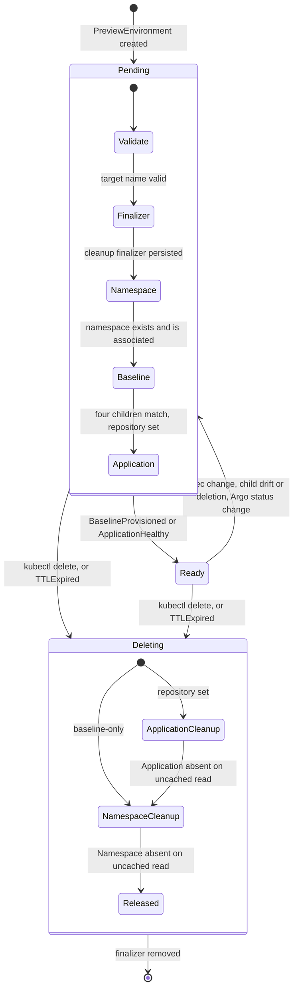

# Design

How a `PreviewEnvironment` becomes an isolated namespace, optionally an Argo CD Application, and how it is torn down again. The status vocabulary is in [conditions.md](conditions.md); the expectations, observations and evidence behind each decision are in [learning.md](learning.md).

## Vocabulary

- **Preview**: a `PreviewEnvironment` object. It lives in a **control namespace** (the smoke tests use the controller's own namespace) and must never be placed inside its target namespace, because deleting that namespace would then delete the object driving the deletion.
- **Target namespace**: `spec.namespace`, or `preview-<CR UID>` when omitted. Always `preview-` prefixed, always a DNS label, immutable including its presence, so a spec edit can never orphan an earlier target.
- **Baseline**: the four namespaced children kept in every target namespace: ResourceQuota, LimitRange and NetworkPolicy named `preview-baseline`, and the `preview-workload` ServiceAccount.
- **Application**: for repository-backed previews, the Argo CD `Application` named `preview-<CR UID>` in the operator-configured Argo namespace.
- **Association**: the label `platform.ellery.dev/preview-uid=<CR UID>` plus the informational annotations `platform.ellery.dev/preview-name` and `platform.ellery.dev/preview-namespace`. It records which preview a resource belongs to. It is not an authorization boundary.

## Lifecycle

Every reconcile recomputes the whole desired state from the spec, in this order, stopping at the first stage that is not satisfied and recording why in the Ready Condition:

1. Deletion in progress → cleanup (see [Deletion and finalizers](#deletion-and-finalizers)).
2. `spec.ttl` parsed. Expired → request deletion of the preview; otherwise remember the deadline so the reconcile can schedule a wake-up.
3. Target name computed and validated.
4. Cleanup finalizer added if missing. This happens before any external resource exists, so a crash between the two leaks nothing: the next reconcile resumes provisioning.
5. Namespace fetched, created if absent, checked for association and termination.
6. Baseline children reconciled in order: NetworkPolicy, LimitRange, ResourceQuota, ServiceAccount. The policy comes first so no pod is ever admitted into an unisolated namespace.
7. Application reconciled when `spec.repository` is set, and readiness derived from Argo's status.
8. Status patched, only if it changed.

## Ownership and association

Kubernetes garbage collection accepts an owner only in the same namespace or a cluster-scoped one. A namespaced preview therefore cannot own its cluster-scoped Namespace, nor an Application in the Argo namespace. Three relationships result:

| Relationship | Mechanism |
|---|---|
| Preview → Namespace | Association label and annotations; cleanup through the preview's finalizer; events mapped back through a field index on the computed target name. No owner reference. |
| Namespace → baseline children | Real owner references (a cluster-scoped Namespace may own namespaced objects) with `blockOwnerDeletion=false`, so the controller needs no `namespaces/finalizers` permission; plus the association label. Namespace deletion removes them. |
| Preview → Application | Association label and name/namespace annotations; cleanup through the same finalizer; events mapped back through an index on the Application name. No owner reference. |

**The controller never adopts.** A Namespace without the matching UID label, a child whose label differs or whose owner references point anywhere but this Namespace's UID, or an Application with a different association or any owner reference, is reported as a conflict (`NamespaceConflict`, `BaselineConflict`, `ApplicationConflict`, `CleanupBlocked`) and left untouched. A recreated namespace carries a new UID, so children from a previous incarnation cannot be taken over either. Editing association labels by hand turns a resource into a conflict; it does not authorize a takeover.

## Namespace reconciliation

The controller reads the preview and computes its target name on each reconcile. It creates a missing Namespace with the association label and annotations. Existing associated namespaces are left unchanged; other namespace metadata is outside the managed state. Unrelated namespaces produce `NamespaceConflict` without adoption or mutation, and removing the conflict triggers another reconcile through the target-name index.

Namespace API errors produce `NamespaceProvisioningFailed` and return an error for controller-runtime backoff. Invalid configuration produces `InvalidConfiguration` without a timed retry. A terminating namespace produces `NamespaceTerminating` and a five-second retry until it is gone and can be recreated.

## Namespace baseline

Each preview gets these reserved resources:

| Resource | Name | Defaults |
|---|---|---|
| ResourceQuota | `preview-baseline` | Requests: 2 CPU / 2Gi memory; limits: 4 CPU / 4Gi memory; 10 pods, 5 services, 20 ConfigMaps, 20 Secrets; zero PVCs, LoadBalancer and NodePort services |
| LimitRange | `preview-baseline` | Container requests: 100m CPU / 128Mi; limits: 500m / 256Mi; min: 10m / 16Mi; max: 1 CPU / 1Gi |
| NetworkPolicy | `preview-baseline` | All pods isolated for ingress and egress, allowing same-namespace pod traffic and DNS to kube-system pods labeled `k8s-app=kube-dns` on UDP/TCP 53 |
| ServiceAccount | `preview-workload` | Token automount disabled; no workload Role or RoleBinding grants |

Workloads must set `spec.serviceAccountName: preview-workload`. The controller leaves the `default` ServiceAccount alone; a Pod can override automount behavior, so this is a safe default rather than an admission-enforced security boundary. Workload Kubernetes API access is deliberately not granted until a concrete requirement exists. Controller RBAC adds only get/list/watch/create/patch for these four resource kinds.

The profile is fixed. Quotas cap declared resources rather than measuring runtime consumption. Stateful workloads, public ingress, external API calls and cross-namespace monitoring are outside it. Verify cluster DNS labels and whether NodeLocal DNS is used before deployment; a node-local resolver needs a different egress design. Same-namespace traffic is allowed; other pod ingress/egress is denied unless another policy allows it. NetworkPolicies combine additively and do not provide strict tenant isolation from node traffic or privileged workloads. See the upstream [NetworkPolicy semantics](https://kubernetes.io/docs/concepts/services-networking/network-policies/) and [ServiceAccount configuration](https://kubernetes.io/docs/tasks/configure-pod-container/configure-service-account/).

Desired specs are pure functions recomputed on every reconcile. Partial creation survives errors and restarts. Optimistic patches change only the reserved policy specs, the association label, the Namespace owner reference and the ServiceAccount token-automount field; unmanaged annotations and labels and ServiceAccount `imagePullSecrets` are preserved. Existing resources without a matching association, or with another owner, produce `BaselineConflict` without adoption, and removing or correcting the conflict enqueues reconciliation even if the object has no label. Terminating children produce `BaselineTerminating` with a bounded retry; API errors produce `BaselineProvisioningFailed` and backoff. Child create/update/delete watches repair deletion and drift. Repeated reconciliation of correct children performs no writes.

Baseline creation is not atomic, and policy enforcement by a CNI is asynchronous. The Application is created only after baseline provisioning succeeds, and Application manifests must leave baseline resources under this controller's ownership; the example AppProject excludes those kinds.

## Application reconciliation

Repository-backed previews get one Application: fixed operator-configured project (`--argo-project`, never `default`), one Git source (`spec.repository`, `spec.revision`, `spec.path` or `.`), the local cluster server and the computed target namespace as destination, automated sync with prune and self-heal, `allowEmpty=false` and `FailOnSharedResource=true`. Namespace auto-creation is not enabled. The controller owns the entire Application spec and repairs drift; metadata, status and finalizers set by others are preserved, and Argo's `resources-finalizer.argocd.argoproj.io` is always present so deletion cascades to the workloads.

Readiness is derived from Argo's status in this order: any `*Error` Condition → `ApplicationError`; `status.sync.comparedTo` not matching the desired source and destination → `ApplicationPending` (Argo's Application has no `observedGeneration`, so this is how a stale Healthy after a revision change is rejected); a running or requested operation → `ApplicationSyncing`; not `Synced` → `ApplicationOutOfSync`; not `Healthy` → `ApplicationUnhealthy`; otherwise `ApplicationHealthy` and Ready. A just-written spec is reported `ApplicationPending` immediately rather than trusting the old status.

The Application is handled as an `unstructured.Unstructured` so the controller does not import Argo CD's server packages; fields are validated in envtest against the unchanged upstream v3.3.0 CRD. The full contract, installation and smoke test are in [argocd.md](argocd.md).

## Preview lifetime

`spec.ttl` sets a deadline of `metadata.creationTimestamp + ttl`, published as `status.expiresAt`. Every reconcile that returns no error schedules a work-queue wake-up at that deadline, including conflict and pending states, so a preview that never becomes Ready still expires, and an earlier timed retry is preserved. At the deadline the controller records `TTLExpired` and deletes the preview with UID/resourceVersion preconditions, so a concurrent TTL extension invalidates the decision. Deletion then follows the normal finalizer path. Behavior and edge cases are in [ttl.md](ttl.md).

## Deletion and finalizers

Cleanup uses the finalizer `platform.ellery.dev/namespace-cleanup`, persisted before the namespace is created. On deletion the controller:

1. For repository-backed previews, deletes the Application with UID/resourceVersion preconditions and waits (`ApplicationCleanupInProgress`) until an **uncached** read no longer finds it. Argo CD's foreground finalizer removes the workloads first; the controller never removes that finalizer. With integration disabled the preview stays `CleanupBlocked` rather than deleting a namespace Argo may still be syncing into.
2. Sets phase `Deleting` / `CleanupInProgress`, deletes the namespace with UID/resourceVersion preconditions, and waits until an uncached read no longer finds it. It never removes the namespace's own finalizers; Kubernetes must finish removing its contents.
3. Removes its finalizer. Other finalizers on the preview are preserved.

Both reads deliberately bypass the manager cache: a cached `NotFound` is not proof that the resource is gone, and releasing the finalizer on it would leak the namespace. The preconditions ensure a namespace or Application replaced or relabelled after the ownership check is not deleted on the strength of that earlier check; such a write fails with a conflict and retries.

Temporary read/delete errors produce `CleanupFailed` and backoff. An ownership mismatch produces `CleanupBlocked` and retains the finalizer until the association is resolved or the object is removed. Namespace and Application events drive progress, with five-second retries while deletion is in progress. Waiting reconciles are idempotent: equal status is not patched and deletion is not re-requested. A controller restart resumes from the persisted finalizer and the live state of the namespace and Application.

## Watches, predicates and indexes

| Watched kind | Mapped through | Update filter |
|---|---|---|
| PreviewEnvironment (primary) | — | `previewPredicate`: generation, `deletionTimestamp` or finalizer list changed. Status-only updates are dropped. Generation alone would miss deletion, because Kubernetes sets `deletionTimestamp` without bumping generation. |
| Namespace | `namespaceIndex` on the target name, matched against the namespace name | none (every event) |
| ResourceQuota, LimitRange, NetworkPolicy, ServiceAccount | `namespaceIndex`, matched against the object's namespace | `baselinePredicate`: deep-equal after blanking `resourceVersion`, `managedFields` and ResourceQuota `status`, so quota usage accounting does not trigger reconciles but spec and metadata drift do |
| Application (only with `--argo-namespace`) | `applicationIndex` on `preview-<CR UID>`, restricted to the Argo namespace | `baselinePredicate` (status changes pass, which is how sync/health updates arrive) |

Because the indexes key on the *desired* name rather than on labels, an unlabelled conflicting object still maps back to its preview, so removing a conflict triggers recovery without polling. There is no steady-state polling: the only timers are five-second requeues while something is terminating and the TTL wake-up.

Normal reads go through the manager cache, so a successful write can precede visibility: a cached `NotFound` followed by `AlreadyExists`, or an optimistic-lock conflict, is retried through the work queue rather than treated as a conflict to adopt. controller-runtime 0.25 bypasses the cache for unstructured objects by default; the manager enables cached unstructured reads explicitly and scopes the Application informer to the Argo namespace to match the namespace-scoped Role. Cleanup decisions use `mgr.GetAPIReader()` instead.

## Status writes

`setStatus` rebuilds the whole status from the current decision: `observedGeneration`, `namespace`, `phase`, `expiresAt`, the Ready Condition, and for repository-backed previews the Application fields and Conditions. Application observations are cleared whenever the baseline is not ready so an old `Synced`/`Healthy` never accompanies a failed namespace. `meta.SetStatusCondition` keeps `lastTransitionTime` when the status does not change, the result is compared with the previous status, and nothing is written when they are equal. Writes are optimistic-lock merge patches on the status subresource; a conflict returns through backoff.

## Observability hooks

Each stage runs inside a span (`preview.reconcile` with nested `preview.namespace`, `preview.baseline`, `preview.application`, `preview.status`, `preview.cleanup`, `preview.expiry`) and records a `preview_environment_step_duration_seconds` observation with fixed `step` and `outcome` labels (`success`, `conflict`, `forbidden`, `timeout`, `error`). Preview identity appears only as span attributes; repository URLs, revisions, raw errors and Condition messages appear in neither. Tracing is a no-op unless enabled. See [telemetry.md](telemetry.md).

## Security boundaries

Association labels are metadata, not authorization: limit RBAC access to previews and to namespace metadata, and treat PreviewEnvironment creation and target-name choice as trusted administrative actions. The baseline is a safe default rather than a hard boundary: a Pod can re-enable token automount, NetworkPolicies are additive and depend on CNI enforcement, and quotas constrain declared rather than consumed resources. The sample AppProject allows one trusted repository, the local cluster, `preview-*` destinations and Deployment/Service/ConfigMap kinds, and denies cluster-scoped resources and the baseline kinds; a shared project allowing `preview-*` is not a hostile-tenant boundary. Kubernetes RBAC does not constrain Application creation by project or label, so the controller's Application Role is scoped to the Argo namespace and the controller cannot edit AppProjects.
